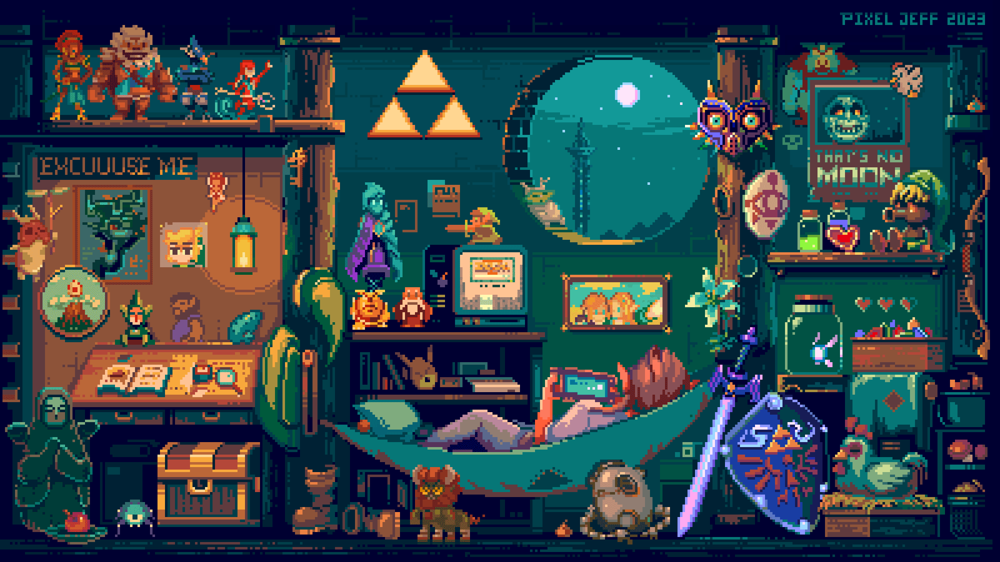

{: .img-overlay}
Texte qui apparaît par-dessus l'image
# :dizzy: About Me:
:space_invader: Welcome to my GitHub! About Me :wave: Hi, I’m Johnny Sassiat! I’m a Front-End Developer with a passion for creating interactive interfaces, developing immersive experiences, and working with data and AI. Currently, I’m working on ITV and Coda-Classroom while diving deeper into React and SaaS development.  :computer: Key Skills Languages: HTML | CSS | JavaScript | PHP Frameworks / Libraries: React | Tailwind CSS Tools: GitHub | Visual Studio Code Expertise Areas: Front-End Development, UI/UX, Data Visualization :earth_africa: Connect with Me :e_mail: Email: [johnny.sass2001@gmail.com]  :video_game: Fun Fact "Actually, after giving it some thought... I might be the Dragonborn, but I just don’t know it yet."

## :globe_with_meridians: Socials:
 

# :computer: Tech Stack:
            
# :bar_chart: GitHub Stats:

 

## :trophy: GitHub Trophies

### :writing_hand: Random Dev Quote

### :top: Top Contributed Repo

---

